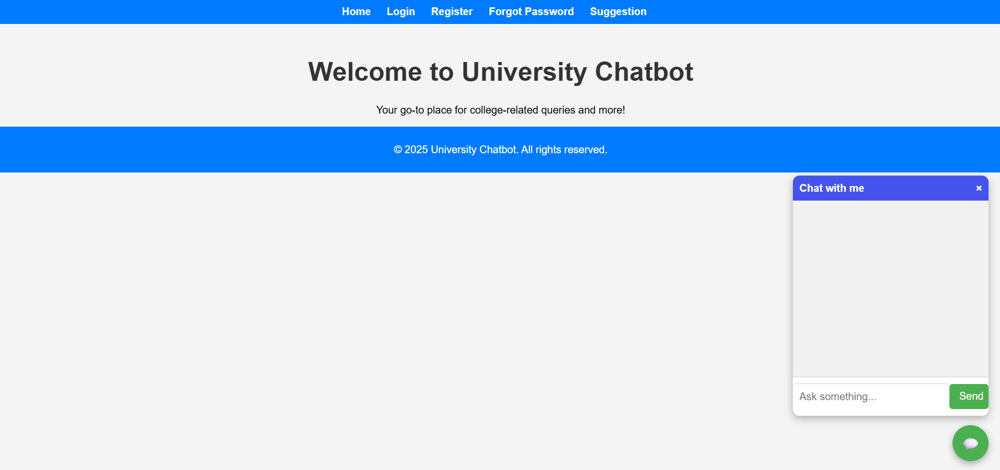
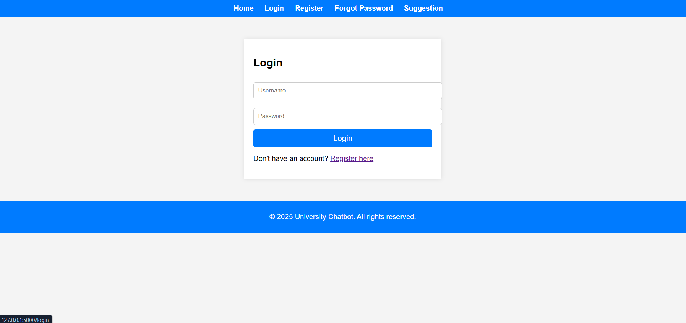
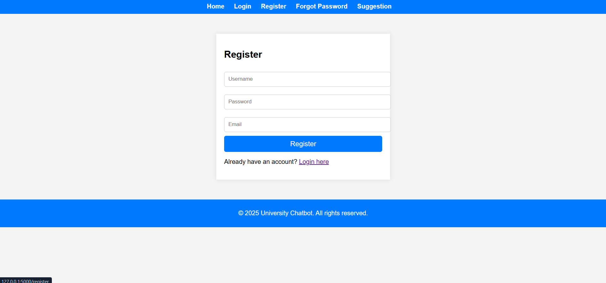
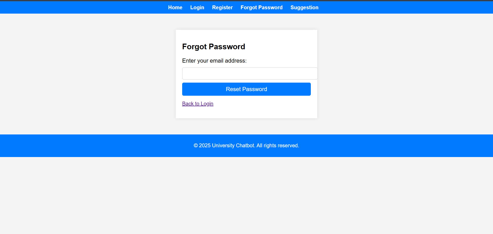
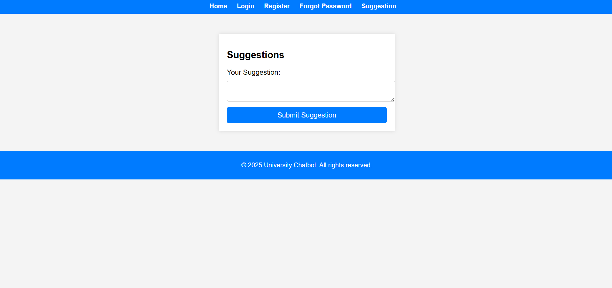
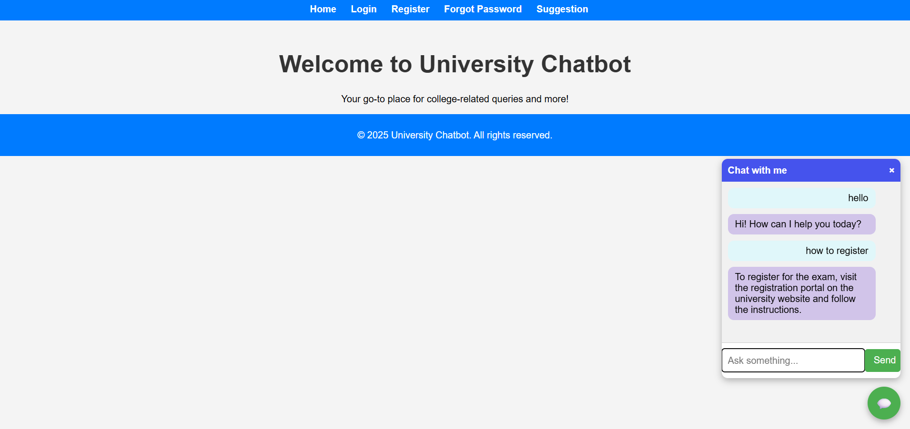

# 🎓 University Chatbot

A web-based chatbot application designed to help university students get quick answers to their college-related queries — from courses and facilities to campus life. Built with a login/register system, dynamic chat interface, and server-side processing using Flask.

## Features

- **Login & Registration** system with user authentication.
- **Home Page** that welcomes users and explains the chatbot's purpose.
- **Floating Chat Widget** ("cRCe - Chat with me") similar to Facebook Messenger on desktop.
- Real-time Q&A using a Python backend with NLP logic.
- Responsive and minimal design using HTML5, CSS3, JavaScript, and jQuery.
- Easily extendable for integrating advanced models like BERT or GPT.


## How It Works

1. **User visits the home page** and sees a welcome message with login/register options.
2. After login, the user is redirected to the **dashboard** where the chatbot widget is available.
3. The **floating chat icon** opens a styled popup where the user can ask questions.
4. Questions are sent to the `/chatbot` Flask route, where Python processes them.
5. Responses are dynamically displayed inside the chatbox.

## Tech Stack
 - Frontend: HTML5, CSS3, JavaScript, jQuery

 - Backend: Python 3, Flask

 - Database: SQLite or MySQL (customizable)

## Future Improvements
 - Integrate BERT or GPT for smarter answers.

 - Add admin panel for managing FAQ data.

 - Enable chat history and saved sessions.

 - Support for multilingual queries.

## Credits
 - Developed as a university-level academic project for assisting students with common queries using a smart, interactive chatbot interface.


## Preview

Here are some screenshots of the University Chatbot in action:


---

---

---

---

---



## Setup Instructions

### 1. Clone the Repository

```bash
git clone https://github.com/your-username/university-chatbot.git
cd university-chatbot

2. Create a Virtual Environmentbash
python -m venv venv
source venv/bin/activate

3. Install Dependencies
pip install -r requirements.txt

4. Run the App

python app.py
